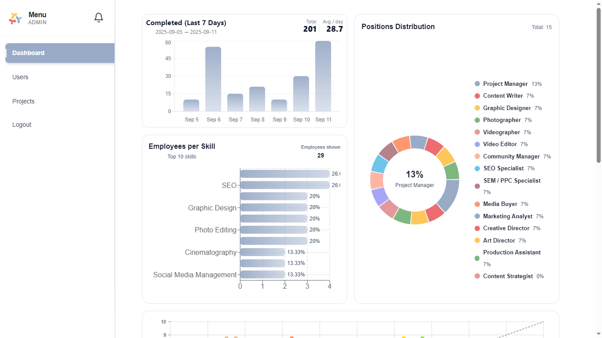
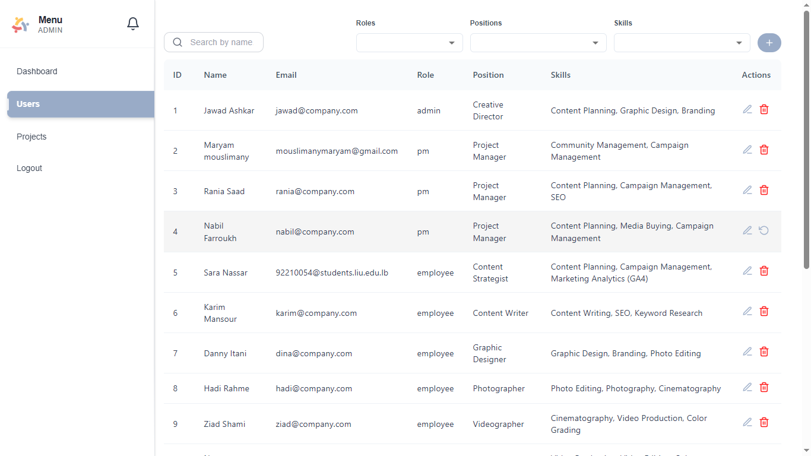

 

<!-- project overview -->

> Orchestrik is a company-ready task management platform for teams that don’t have room for mess. It blends AI assignment, automation, and clear data visualizations to keep work moving, lock in ownership, and hit deadlines. From kickoff to delivery, tasks route to the right people, updates are automatic, and progress is visible.

 

<!-- System Design -->

### ER Diagram

### Component Diagram

 

<!-- Project Highlights -->

### Add Title Here
- List the sexy features.

 

<!-- Demo -->

### Admin Screens

| Dashboard                              | Dashboard                        |                         |
| -------------------------------------- | -------------------------------- | ----------------------- |
|  |  |

| Create Project                           | Users Management                   |                         |
| ---------------------------------------- | ---------------------------------- | ----------------------- |
|  |   |

### Project Manager Screens

| Projects Managed by this PM             | Project Analytics                  |
| -------------------------------------- | ---------------------------------- |
|  |  |

| View Tasks                              | Create Task                        |                         |
| --------------------------------------- | ---------------------------------- | ----------------------- |
|   |  |

### Employee Screens

| Assigned Tasks                           | Mark Task progress                 |
| ---------------------------------------- | ---------------------------------- |
|  |  |

### Sexy Features

| Ai Agent Auto Assign                     | Data Visualization                 |
| ---------------------------------------- | ---------------------------------- |
|  |  |

n8n Automation: Slack Channel Creation  

 

<!-- Development & Testing -->

### Services, Validation and Testing

| Services                                 | Validation                         | Testing                           |
| ---------------------------------------- | ---------------------------------- | --------------------------------- |
|  |  |  |

### Ci Workflow

|                                          |                                    |
| ---------------------------------------- | ---------------------------------- |
|      |  |

### Linear

**We use Linear to plan sprints, track issues, and connect work with code.** Epics and issues in Linear mirror Orchestrik’s project/task states, so status changes in one place reflect across the board, analytics stay accurate, and ownership is always visible.

|                                          |                                    |
| ---------------------------------------- | ---------------------------------- |
|  |  |

#### Linear Workflow (high level)
1. **Create issue/epic** → define scope and acceptance criteria.  
2. **Prioritize & assign** → owner + due date mapped to Orchestrik.  
3. **Link PRs/commits** → dev progress auto-updates status.  
4. **Review & QA** → moves through review → done with audit trail.  
5. **Report** → velocity, cycle time, and status feed dashboards.

 

<!-- Deployment -->

### Add Title Here
- Description here.

| Postman API 1                            | Postman API 2                       | Postman API 3                        |
| ---------------------------------------- | ----------------------------------- | ------------------------------------ |
|   |  |  |

 
