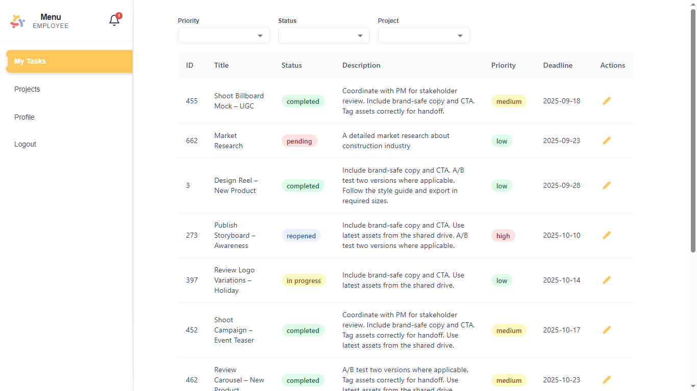
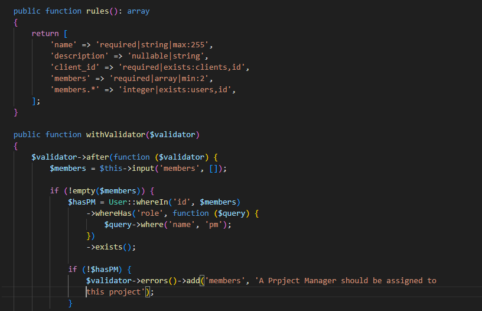

 

<!-- project overview -->

> Orchestrik is a company-ready task management platform for teams that don’t have room for mess. It blends AI assignment, automation, and clear data visualizations to keep work moving, lock in ownership, and hit deadlines. From kickoff to delivery, tasks route to the right people, updates are automatic, and progress is visible.

 

<!-- System Design -->

### ER Diagram

### Component Diagram

 
<!-- Project Highlights -->

### Project Highlights

- **AI Agent Auto-Assign:** Takes the task title and description, extracts the required skills, matches them to members’ skill profiles, and if multiple qualify compares current workload (e.g., open tasks) to assign the least-loaded qualified member.

- **n8n Automation (Slack Channel Creation):** On project creation, an n8n workflow creates a Slack channel, invites the team members, and posts a kickoff message so collaboration starts instantly.

- **Clear Charts & Data Visualization:** Dashboards show status breakdowns, per-assignee and per-project views, and trends over time (throughput, cycle time, reopens, overdues), with filters and tooltips for quick drill-downs.

- **Live Notifications:** Real-time notifications let users know when they’re assigned, mentioned, or when task status changes, updating badges and lists instantly without refresh.

 

<!-- Demo -->

### Admin Screens

| Dashboard                              | Dashboard                        |                         |
| -------------------------------------- | -------------------------------- | ----------------------- |
|  |  |

| Create Project                           | Users Management                   |                         |
| ---------------------------------------- | ---------------------------------- | ----------------------- |
|  |   |

### Project Manager Screens

| Projects Managed by this PM             | Project Analytics                  |
| -------------------------------------- | ---------------------------------- |
|  |  |

| View Tasks                              | Create Task                        |                         |
| --------------------------------------- | ---------------------------------- | ----------------------- |
|   |  |

### Employee Screens

| Assigned Tasks                           | Mark Task progress                 |
| ---------------------------------------- | ---------------------------------- |
|  |  |

### Sexy Features

| Ai Agent Auto Assign                     | Data Visualization                 |
| ---------------------------------------- | ---------------------------------- |
|  |  |

n8n Automation: Slack Channel Creation  

 

<!-- Development & Testing -->

### Services, Validation and Testing

| Services                                 | Validation                         | Testing                           |
| ---------------------------------------- | ---------------------------------- | --------------------------------- |
|  |  |  |

### Ci Workflow

|                                          |                                    |
| ---------------------------------------- | ---------------------------------- |
|      |  |

### Linear
I chose Linear to manage tasks and sprints because it keeps development work connected to issues. Each feature or bug fix starts with a Linear ticket, which links directly to branches, commits, and pull requests, making the workflow easier to follow.

|                                          |                                    |
| ---------------------------------------- | ---------------------------------- |
|  |  |

#### Linear Workflow (high level)
Create a ticket in Linear →  
Create a Git branch (following Linear’s naming conventions) →  
Commit changes (include the corresponding task ID in the commit message) →  
Push the branch to the remote repository →  
Open a pull request and request a review →  
Merge the pull request once it has been reviewed and approved.

### API Docs & Testing (Swagger & Postman)

**Swagger:** Live API documentation with schemas and a “Try it out” panel to execute requests against your local server.  
**Postman:** Versioned collections and environments for manual testing and quick regression checks.

#### Swagger

|  |  |
| --- | --- |
|  |  |

#### Postman

### Postman

| Environement | Postman Request & Response | Postman Request & Response |
| --- | --- | --- |
|  |  |  |

 

<!-- Deployment -->

### Deployment (Workflow)

- Create a feature branch locally.
- Push the branch to origin and open a pull request.
- Merge the pull request into dev.
- CI on dev runs tests, builds Docker images for the services, and pushes them to the registry.
- Deploy to staging: pull images, start the stack with docker compose, then run database migrations.
- QA on staging.
- Merge dev into main.
- CI/CD for production: rebuild and push images, deploy with the same compose file, and run migrations.
- Roll back by redeploying a previous image tag and restoring a recent database backup if needed.

 
